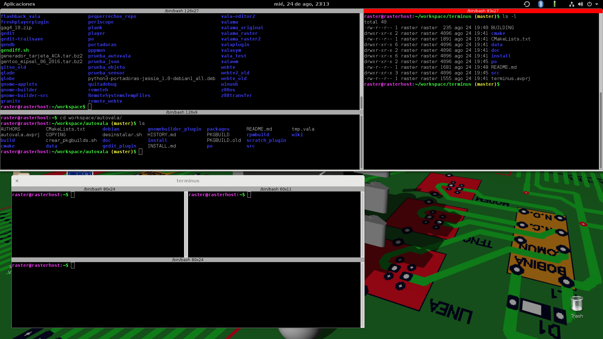

# Terminus #

A new terminal for XWindows and Wayland

## What is it ##

There are plenty of graphic terminals for linux, so what makes this one different?

* it allows to split a window in several tiling subwindows, exactly like the old
Terminator terminal. Of course it can create several simultaneous windows, and allows
to have several tabs in each window.

* allows to have an always-available drop-down terminal in all screens, with an
appearance similar to the Quake console, exactly like Guake.
Of course, the Guake-like terminal can be split in tiling subwindows, wich is its main
novelty.

* supports Drag'n'Drop of terminals between tabs and windows, allowing to reorder
them at will.

* it has been written in Vala and uses Gtk3, which allows it to take advantage
of the new characteristics available and to use less resources.

## Using it ##

Each Terminus window has two buttons at the left: one to create a new Terminus window,
and another to create a new tab in the current window. Also, doing right-click on a
terminal will open a contextual menu which also allows to subdivide it horizontally or
vertically, in tiles.

A terminal can be dragged from the top bar (the red one), and dropped into another
terminal (being added as a new tile), into a new tab in an existing window by dropping
it into the tabs bar or the title bar, or into a new window if dropped outside any
window. A terminal can be moved between different windows too, and even between a
normal window and the Guake one.

By default, using Shift+F12 will show the Quake-like terminal, but you can change
the key binding by pressing right-click and selecting "Properties". Nearly all the
actions in Terminus have a configurable hotkey.

Also by default, Ctrl+Shift combined with the keypad's Add, Subtract and Enter keys
will increase, decrease, and return to normal, font size. You can also use
Ctrl + Mouse Wheel to change the font size (and Ctrl + middle button to return to
the normal size).

By default, terminus is launched during startup to check if the user wants to have
the Quake-like terminal available, so just installing it and rebooting will guarantee
to have it. You can also launch it from a terminal.

Currently the number of options modifiable is small, but more will become available.

Under Gnome Shell (and derived desktops) be sure to enable the extension, to allow
you to launch the Guake mode terminal.

## Compiling it ##

Just follow the classic meson instructions:

    meson setup _build
    ninja -C _build
    sudo ninja install -C _build

If, during meson stage, you receive an error for missing libraries, install them
and run meson again, until there are no more missing libraries.

## Creating new palettes ##

It is very easy to add new palettes to Terminus. Just edit a file with *.color_scheme*
as extension, and place it at */usr/share/terminus* (or */usr/local/share/terminus*,
depending where you installed the binaries) to have it globally available, or at
*~/.local/share/terminus* to make it available only to you.

The format is very simple. Here is an example that defines a foreground/background
color scheme:

    name: Orange on black
    name[es]: Naranja sobre negro
    text_fg: #FECE12
    text_bg: #000000

This file will define the *Orange on black* color scheme, that specifies that the
foreground will be orange, and the background will be black. It also specifies the name
translated into spanish.

Another example, this time for a palette scheme:

    name: Solarized
    palette: #002b36
    palette: #073642
    palette: #586e75
    palette: #657b83
    palette: #839496
    palette: #93a1a1
    palette: #eee8d5
    palette: #fdf6e3
    palette: #b58900
    palette: #cb4b16
    palette: #dc322f
    palette: #d33682
    palette: #6c71c4
    palette: #268bd2
    palette: #2aa198
    palette: #859900

This one defines the *Solarized* palette, with all its 16 colors. Each *palette*
entry defines one color, and they will be inserted in that precise order. There
must be exactly 16 *palette* entries; no more, no less.

You can define in a single file a color scheme and a palette scheme, but they will
be shown in the app as separated elements. This is: if you define in a single file
a color and palette scheme called MYGREATFULLSCHEME, you will find a color scheme
called MYGREATFULLSCHEME in the color scheme list, and it will change only the
foreground/background colors; and you also will find a palette scheme called
MYGREATFULLSCHEME in the palette scheme list, and it will change only the palette
itself, but not the foreground/background colors.

## FAQ ##

**Q:** I use Gnome-Shell/Ubuntu desktop and when I show the Quake terminal, it doesn't get the focus.  
**A:** Be sure to install and enable the Terminus extension, even under X11.
Then do a *killall terminus* to relaunch it from the extension, and everything
should work fine.

**Q:** I'm using Wayland, and pressing Alt+F12 (or my keybinding) doesn't show the Quake-like
terminal.  
**A:** That's because Wayland doesn't allow to an application to set its own keybindings.
Fortunately, Terminus includes a Gnome Shell extension that allows to show the Quake-like
terminal. If you have installed Terminus, just exit your session, enter again, and enable
the extension with gnome-tweak-tool.

Another way is using the desktop keybindings to launch the script "terminus_showhide",
which makes use of the DBus remote control to show and hide the Quake-like terminal.

In Gnome Shell it is as easy as opening the Settings window, choose the "Keyboard" icon,
and add there the desired hotkey, associating it with "terminus_showhide" program.

**Q:** I translated Terminus, but the color and palette schemes aren't translated. Why?  
**A:** You have to also translate the ".color_scheme" files located at data/local.

## Contacting the author ##

Sergio Costas Rodriguez  
<rastersoft@gmail.com>  
<http://www.rastersoft.com>  
<https://gitlab.com/rastersoft/terminus>
